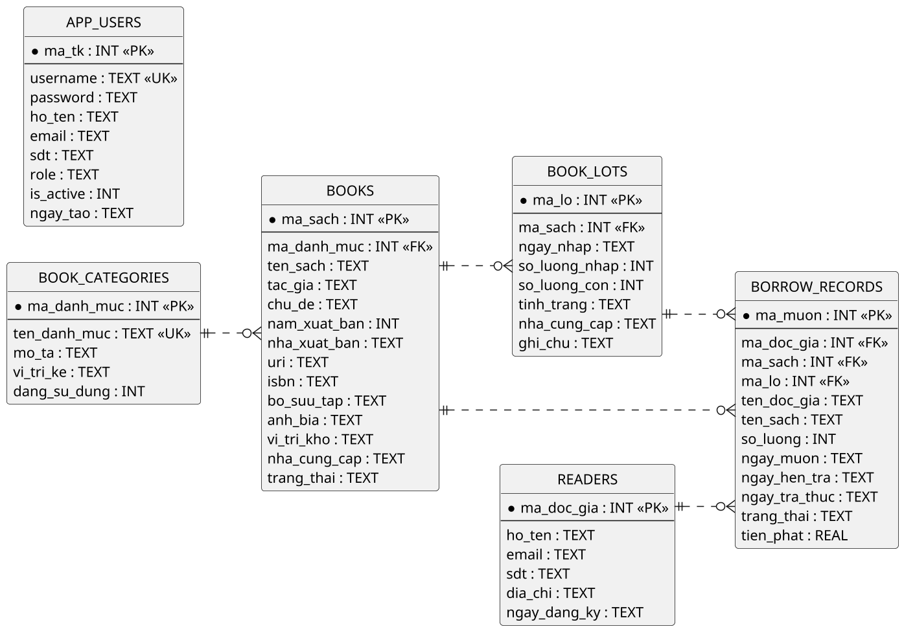

# ERD Hệ Thống Quản Lý Thư Viện (Theo `library_management.sql`)

ERD chuẩn (PlantUML) nằm tại:
- `/home/atin/ntiendung/PTTK/docs/ERD_LIBRARY_MANAGEMENT.puml`

```puml
@startuml
hide circle
left to right direction
skinparam monochrome true
skinparam shadowing false
skinparam linetype ortho
skinparam roundcorner 6
skinparam defaultFontName Arial
skinparam dpi 150

entity "BOOK_CATEGORIES" as BOOK_CATEGORIES {
  * ma_danh_muc : INT <<PK>>
  --
  ten_danh_muc : TEXT <<UK>>
  mo_ta : TEXT
  vi_tri_ke : TEXT
  dang_su_dung : INT
}

entity "BOOKS" as BOOKS {
  * ma_sach : INT <<PK>>
  --
  ma_danh_muc : INT <<FK>>
  ten_sach : TEXT
  tac_gia : TEXT
  chu_de : TEXT
  nam_xuat_ban : INT
  nha_xuat_ban : TEXT
  uri : TEXT
  isbn : TEXT
  bo_suu_tap : TEXT
  anh_bia : TEXT
  vi_tri_kho : TEXT
  nha_cung_cap : TEXT
  trang_thai : TEXT
}

entity "BOOK_LOTS" as BOOK_LOTS {
  * ma_lo : INT <<PK>>
  --
  ma_sach : INT <<FK>>
  ngay_nhap : TEXT
  so_luong_nhap : INT
  so_luong_con : INT
  tinh_trang : TEXT
  nha_cung_cap : TEXT
  ghi_chu : TEXT
}

entity "READERS" as READERS {
  * ma_doc_gia : INT <<PK>>
  --
  ho_ten : TEXT
  email : TEXT
  sdt : TEXT
  dia_chi : TEXT
  ngay_dang_ky : TEXT
}

entity "APP_USERS" as APP_USERS {
  * ma_tk : INT <<PK>>
  --
  username : TEXT <<UK>>
  password : TEXT
  ho_ten : TEXT
  email : TEXT
  sdt : TEXT
  role : TEXT
  is_active : INT
  ngay_tao : TEXT
}

entity "BORROW_RECORDS" as BORROW_RECORDS {
  * ma_muon : INT <<PK>>
  --
  ma_doc_gia : INT <<FK>>
  ma_sach : INT <<FK>>
  ma_lo : INT <<FK>>
  ten_doc_gia : TEXT
  ten_sach : TEXT
  so_luong : INT
  ngay_muon : TEXT
  ngay_hen_tra : TEXT
  ngay_tra_thuc : TEXT
  trang_thai : TEXT
  tien_phat : REAL
}

BOOK_CATEGORIES ||..o{ BOOKS
BOOKS ||..o{ BOOK_LOTS
READERS ||..o{ BORROW_RECORDS
BOOKS ||..o{ BORROW_RECORDS
BOOK_LOTS ||..o{ BORROW_RECORDS

@enduml
```
