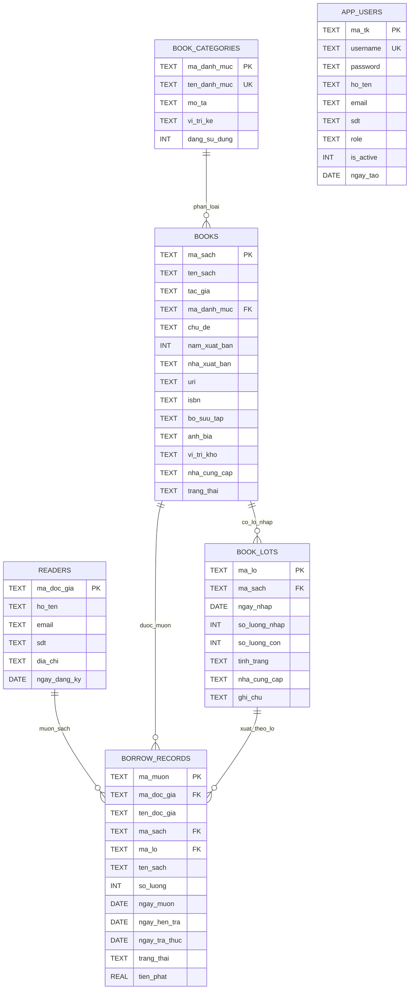

# Sơ Đồ ERD Hệ Thống Quản Lý Thư Viện

## Ghi chú
- `APP_USERS` độc lập với `READERS` trong thiết kế hiện tại (chưa gắn FK trực tiếp).
- `BORROW_RECORDS.ten_doc_gia` và `BORROW_RECORDS.ten_sach` là dữ liệu snapshot lịch sử.
- Quan hệ cốt lõi cho nghiệp vụ lô sách là `BOOKS -> BOOK_LOTS -> BORROW_RECORDS`.
