# Danh sách UC đã làm + Biểu đồ tuần tự (khớp tài liệu ca sử dụng và mã nguồn)

## 1) Danh sách UC đã triển khai

### Chung
- UC-1: Đăng nhập

### Thủ thư
- UC-2: Quản lý danh mục sách
- UC-3: Quản lý đầu sách
- UC-4: Quản lý sách (quyển sách)
- UC-5: Xử lý trả sách
- UC-6: Duyệt mượn sách
- UC-7: Quản lý thông tin độc giả
- UC-8: Gửi thông báo
- UC-9: Tra cứu sách

### Độc giả
- UC-10: Mượn/Trả sách
- UC-11: Xem lịch sử mượn
- UC-15: Nhận thông báo

### Quản trị viên
- UC-12: Quản lý người dùng
- UC-13: Báo cáo và thống kê

### Chưa thấy triển khai
- UC-14: Gia hạn mượn

---

## UC-1: Đăng nhập
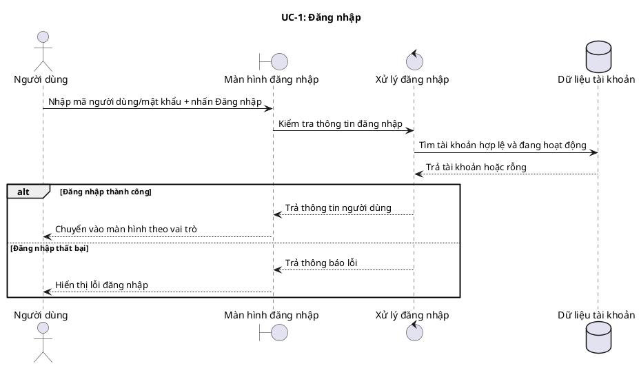

## UC-2: Quản lý danh mục sách
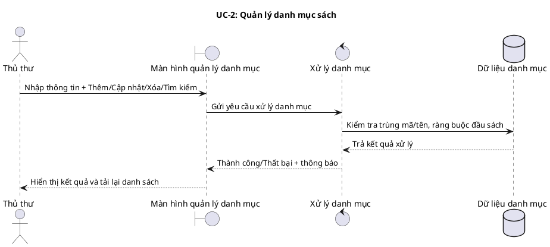

## UC-3: Quản lý đầu sách
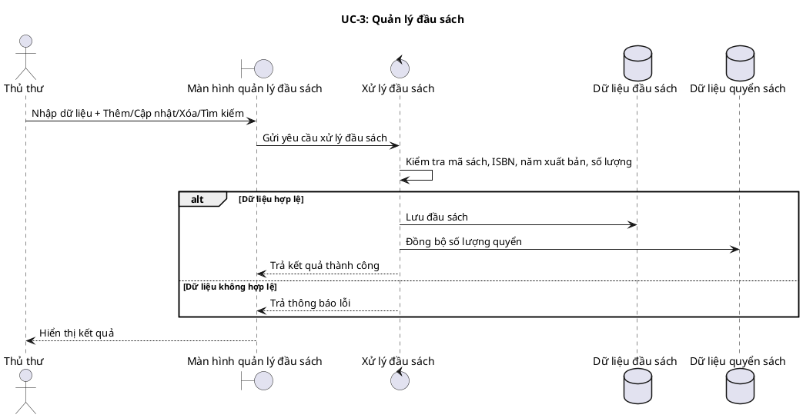

## UC-4: Quản lý sách (quyển sách)
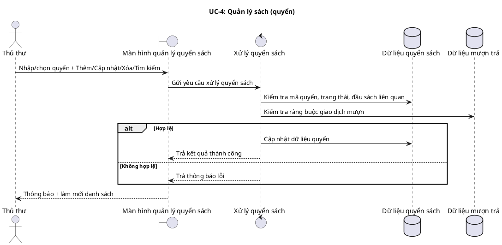

## UC-5: Xử lý trả sách
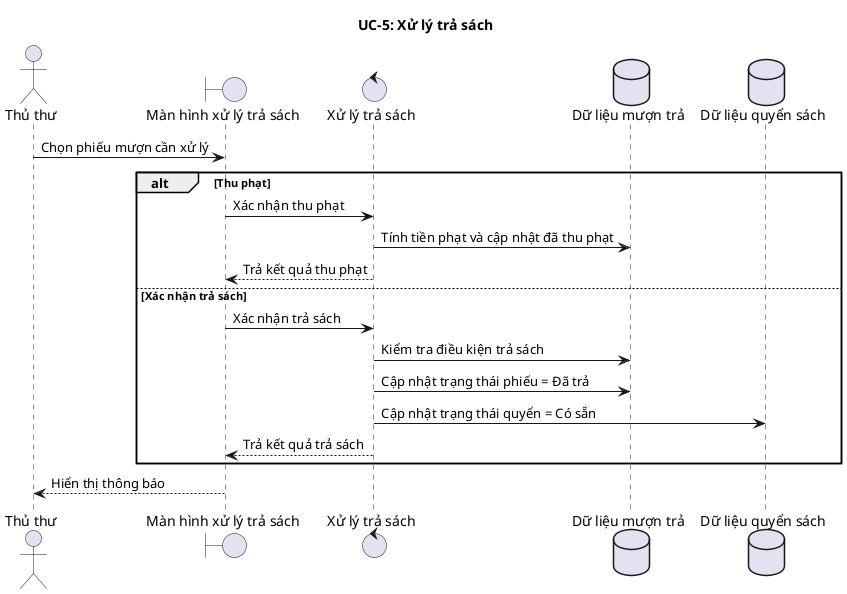

## UC-6: Duyệt mượn sách
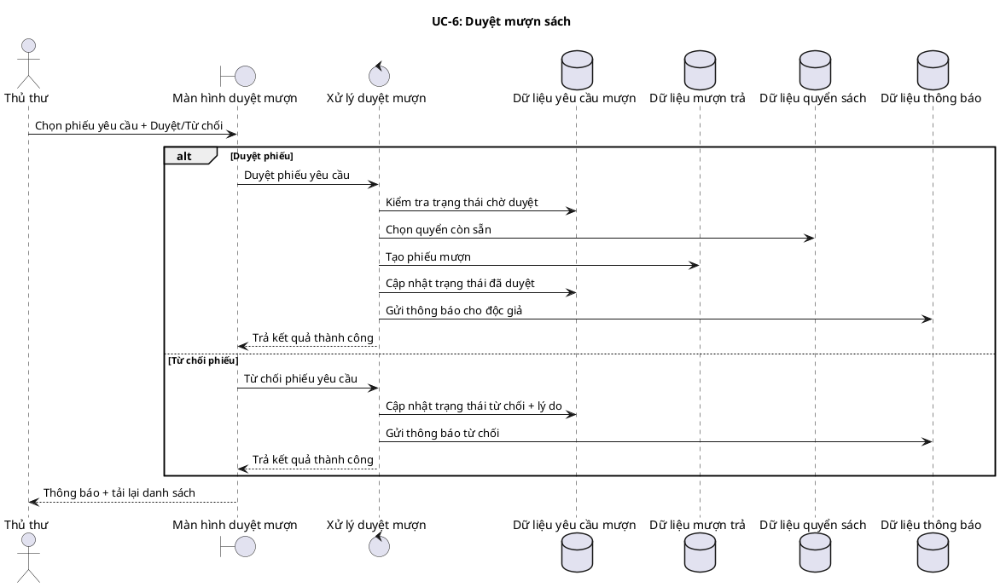

## UC-7: Quản lý thông tin độc giả
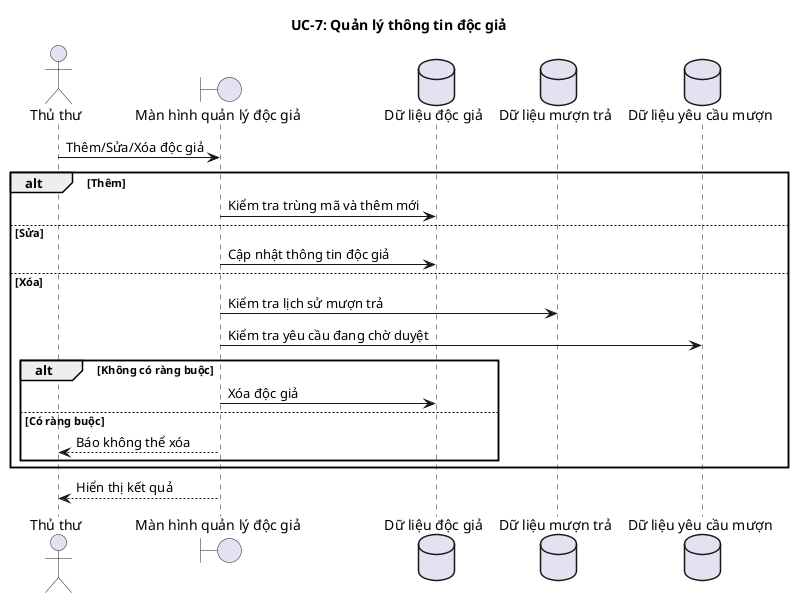

## UC-8: Gửi thông báo
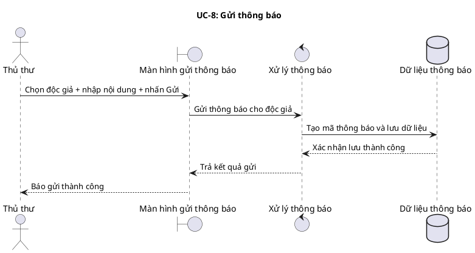

## UC-9: Tra cứu sách
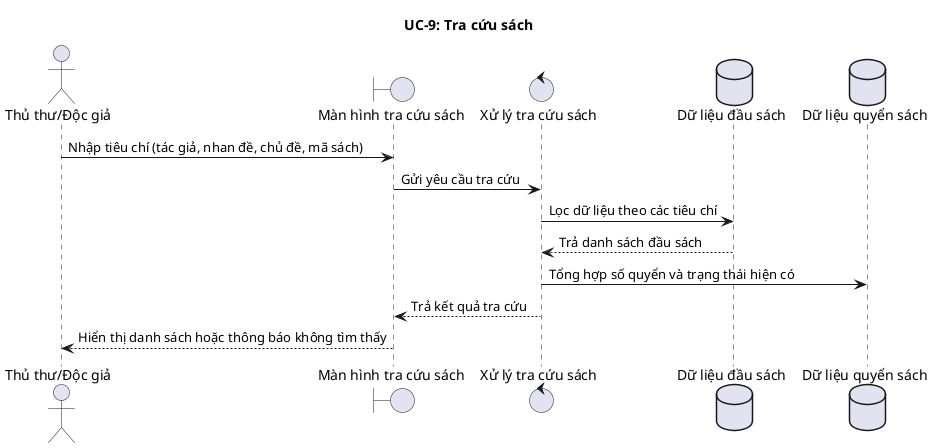

## UC-10: Mượn/Trả sách (Độc giả)
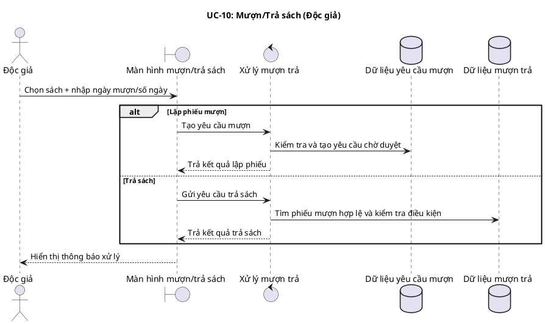

## UC-11: Xem lịch sử mượn
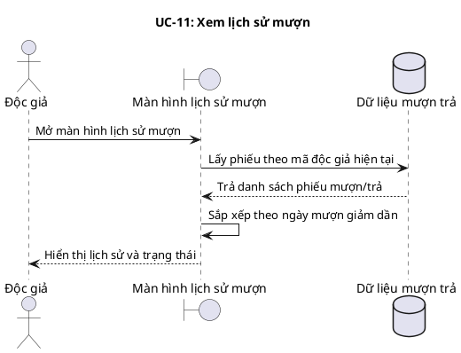

## UC-12: Quản lý người dùng
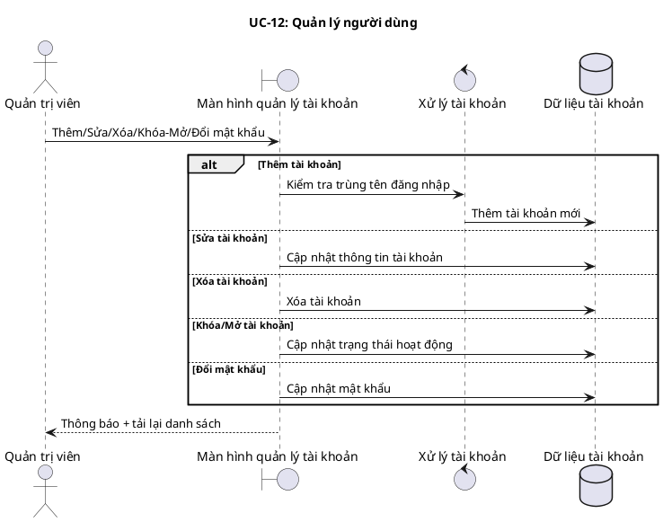

## UC-13: Báo cáo và thống kê
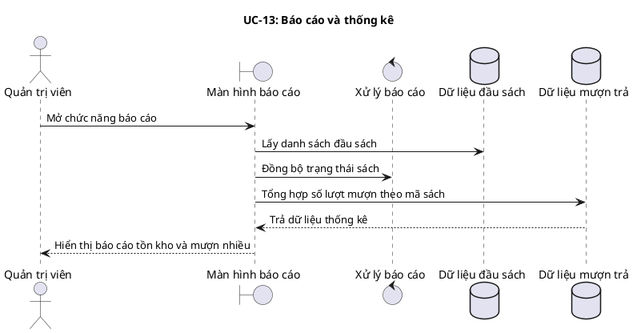

## UC-15: Nhận thông báo
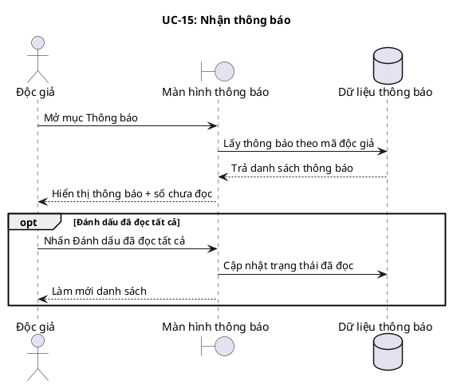

---

## Ghi chú đối chiếu
- Nội dung biểu đồ đã Việt hóa phần hiển thị.
- Một số quy tắc trong tài liệu ca sử dụng chưa thấy hiện thực đầy đủ trong mã nguồn hiện tại (ví dụ: khóa tài khoản sau nhiều lần nhập sai, gia hạn mượn UC-14).
