# Danh sách UC đã làm + Biểu đồ tuần tự

## 1) Danh sách UC đã triển khai

### Thủ thư
- UC-2: Quản lý đầu sách
- UC-3: Tìm kiếm phiếu mượn quá hạn
- UC-4: Xác nhận thu phạt
- UC-5: Xác nhận trả sách
- UC-9: Tra cứu sách

### Độc giả
- UC-12: Lập phiếu mượn
- UC-13: Trả sách
- UC-16: Xem lịch sử mượn

### Quản trị viên
- UC-18: Quản lý người dùng
- UC-19: Báo cáo và thống kê
- UC-17: Quản lý hệ thống (mức khung: truy cập các module quản trị)

---

## UC-2: Quản lý đầu sách (Thủ thư)
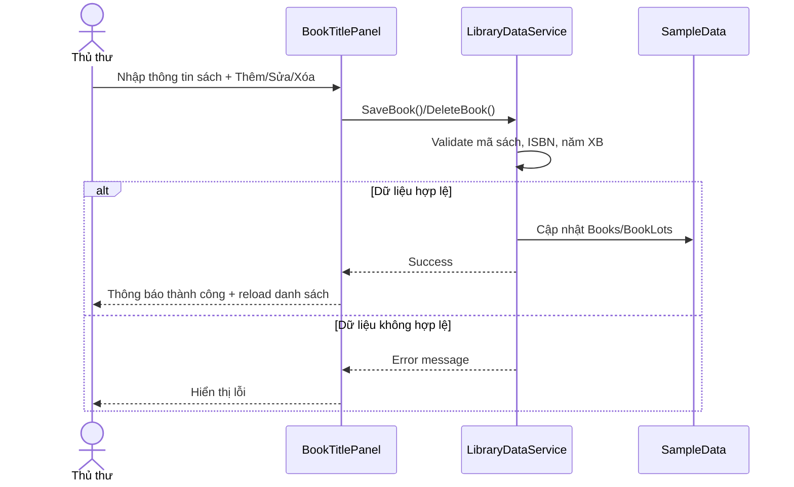

## UC-3: Tìm kiếm phiếu mượn quá hạn (Thủ thư)
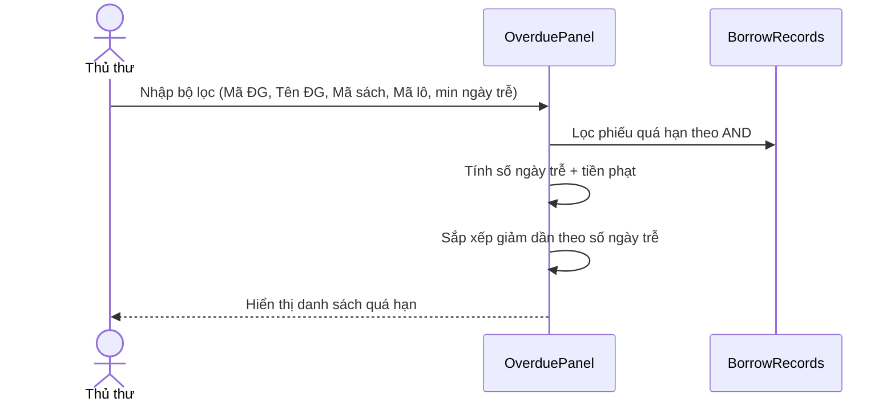

## UC-4: Xác nhận thu phạt (Thủ thư)
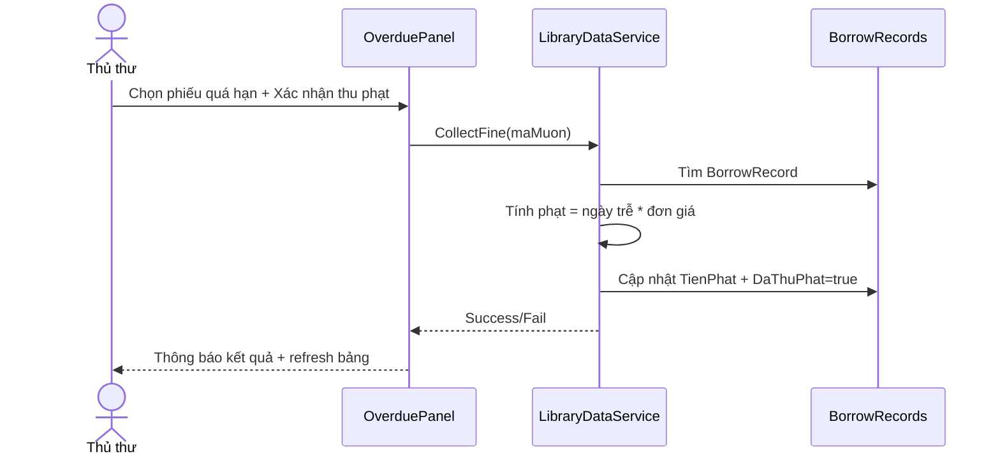

## UC-5: Xác nhận trả sách (Thủ thư)
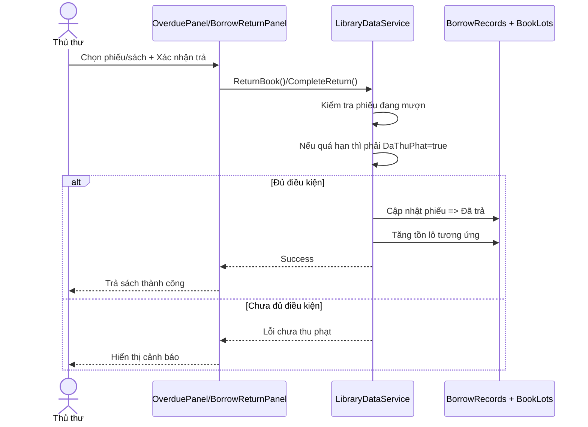

## UC-9: Tra cứu sách (Thủ thư)
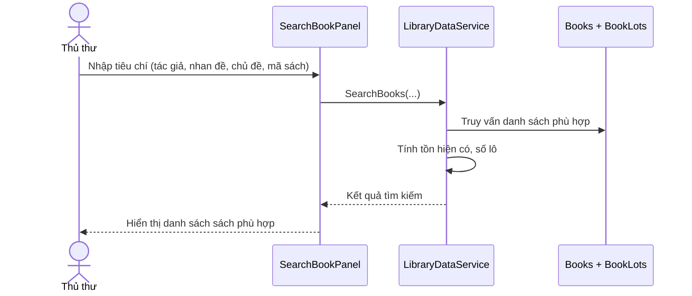

## UC-12: Lập phiếu mượn (Độc giả)
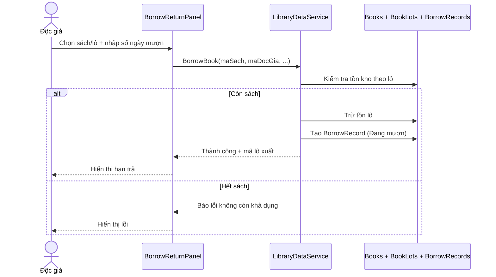

## UC-13: Trả sách (Độc giả)
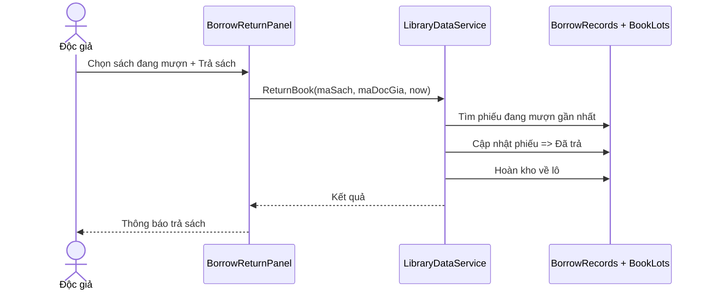

## UC-16: Xem lịch sử mượn (Độc giả)
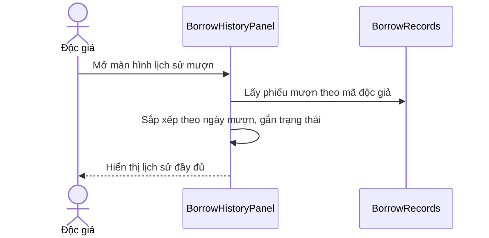

## UC-18: Quản lý người dùng (Admin)
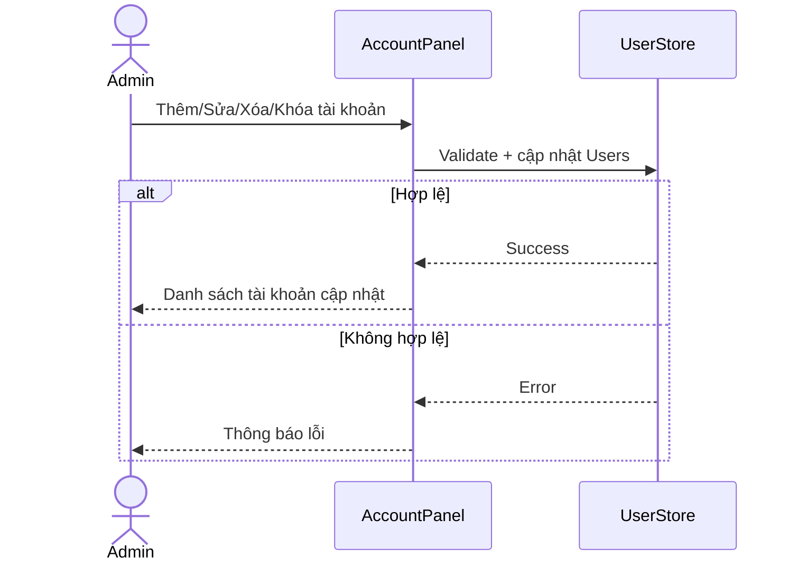

## UC-19: Báo cáo và thống kê (Admin)
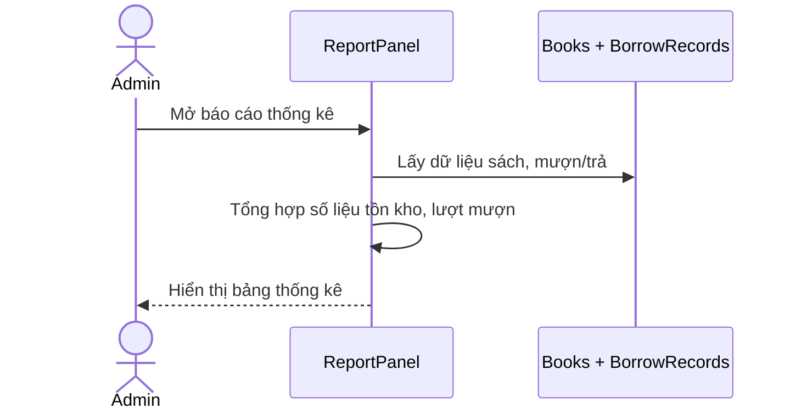

## UC-17: Quản lý hệ thống (Admin - mức khung)
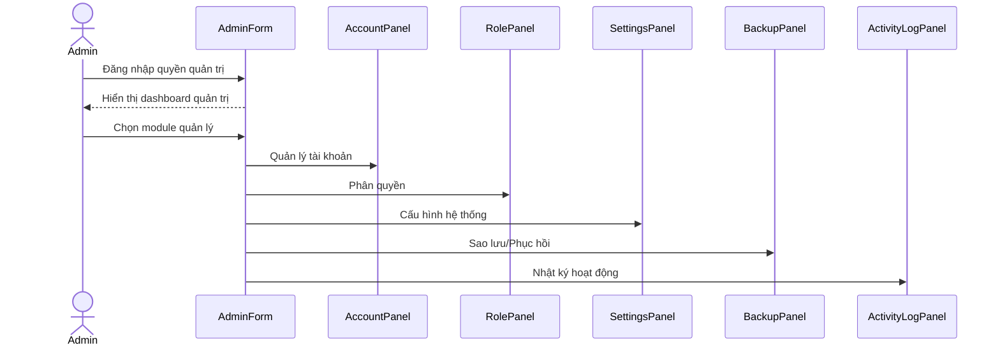
